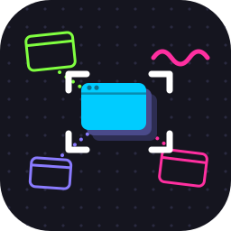
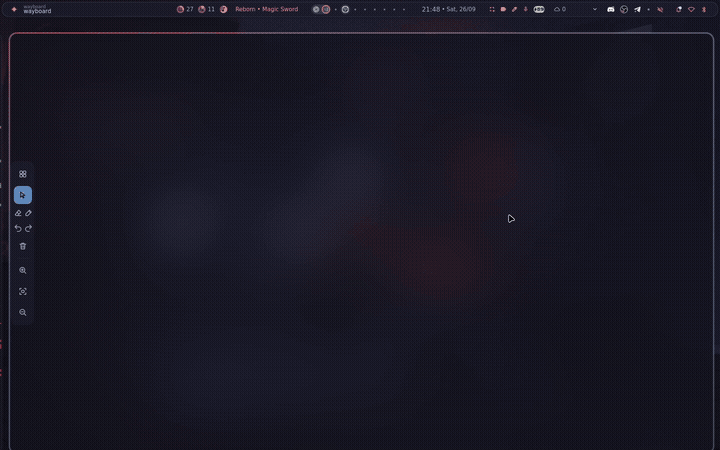

<h1 align="center">Wayboard</h1>

A Wayland compositor where your desktop is a whiteboard

    <a href="docs/getting-started.md">Getting Started</a>
     | 
    <a href="CONTRIBUTING.md">Contributing</a>

# About

Wayboard is a wayland compositor built using Qt 6 that turns your desktop to whiteboard, you can sketch and interact with windows.

Currently it's a work in progress and unstable, so expect bugs and breaking changes. For now I don't recommend using it as daily driver. If you encounter any bug or have an idea you are more than welcome to [contribute](/CONTRIBUTING.md).

# Features

- Infinity canvas
- Annotation
- Built in app launcher
- Undo/Redo annotation

# Roadmap

### Compositor

- Support Xwayland
- Wlr protocols
- Multiple monitors
- Clipboard

### Board

- Support worksapces
- Support gestures
- Save and load the state
- Minimap
- Links: Arrows between windows and notes that follows them when moved
- Groups: Move selected objects together
- Collaboration

### Drawings

- Export board as image/pdf
- Shapes
- Text and sticky notes
- Paste image

### Windows

- Server side window decorations
- Support for multi window layout
- Extract a region of any window onto the board as a snapshot or live
- Text extraction
